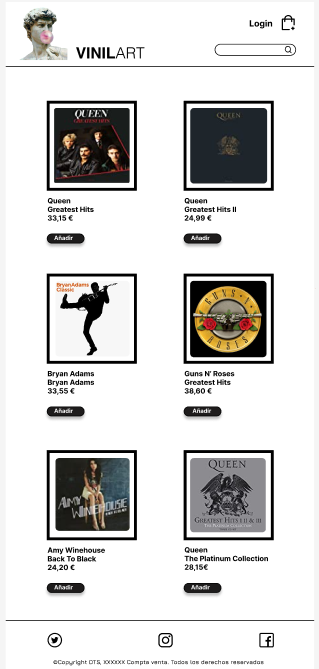

Our project UniversalSound

<!--
### `npm start`

### `npm test`

### `npm run build`

Builds the app for production to the `build` folder.\
It correctly bundles React in production mode and optimizes the build for the best performance.

The build is minified and the filenames include the hashes.\
Your app is ready to be deployed!

See the section about [deployment](https://facebook.github.io/create-react-app/docs/deployment) for more information.

### `npm run eject`

**Note: this is a one-way operation. Once you `eject`, you can't go back!**

If you aren't satisfied with the build tool and configuration choices, you can `eject` at any time. This command will remove the single build dependency from your project.

Instead, it will copy all the configuration files and the transitive dependencies (webpack, Babel, ESLint, etc) right into your project so you have full control over them. All of the commands except `eject` will still work, but they will point to the copied scripts so you can tweak them. At this point you're on your own.

You don't have to ever use `eject`. The curated feature set is suitable for small and middle deployments, and you shouldn't feel obligated to use this feature. However we understand that this tool wouldn't be useful if you couldn't customize it when you are ready for it.

## Learn More

You can learn more in the [Create React App documentation](https://facebook.github.io/create-react-app/docs/getting-started).

To learn React, check out the [React documentation](https://reactjs.org/).

### Code Splitting

This section has moved here: [https://facebook.github.io/create-react-app/docs/code-splitting](https://facebook.github.io/create-react-app/docs/code-splitting)

### Analyzing the Bundle Size

This section has moved here: [https://facebook.github.io/create-react-app/docs/analyzing-the-bundle-size](https://facebook.github.io/create-react-app/docs/analyzing-the-bundle-size)

### Making a Progressive Web App

This section has moved here: [https://facebook.github.io/create-react-app/docs/making-a-progressive-web-app](https://facebook.github.io/create-react-app/docs/making-a-progressive-web-app)

### Advanced Configuration

This section has moved here: [https://facebook.github.io/create-react-app/docs/advanced-configuration](https://facebook.github.io/create-react-app/docs/advanced-configuration)

### Deployment

This section has moved here: [https://facebook.github.io/create-react-app/docs/deployment](https://facebook.github.io/create-react-app/docs/deployment)

### `npm run build` fails to minify

This section has moved here: [https://facebook.github.io/create-react-app/docs/troubleshooting#npm-run-build-fails-to-minify](https://facebook.github.io/create-react-app/docs/troubleshooting#npm-run-build-fails-to-minify)
 -->

[Link a producción](https://movie-gallery-rho.vercel.app/)

## VINILART

Objective:
Our objective is to provide a platform for music enthusiasts to easily discover and purchase antique music albums online. We aim to satisfy the increasing demand for old albums by offering a wide selection of LPs, giving customers the opportunity to find and purchase the albums they are looking for. Our website has been designed with a user-friendly interface, including a navbar, body, and footer with all the necessary functions to provide a seamless shopping experience for our customers.

## Screenshots

### Logo

### Home page

## Requisitos Funcionales (user stories)

> **VER** **GALERIA DE MOVIES (HTTP- GET - ‘/movies’)**
> Como usuario
> Quiero ver una galería de películas con su imagen, título y año de estreno
>
> - Podéis añadir mas campos en el objeto ‘movie’

> **FILTRO DE LA GALERIA DE MOVIES**
> Como usuario
> Quiero una entrada de texto
> para filtrar las películas por campos

> **VER FICHA DE DETALLE DE LA MOVIE (HTTP - GET - ‘/movies/:id’)**
> Como usuario
> Quiero que al hacer click en una película nos lleve a una página
> Para ver los detalles o ficha de la misma.
>
> - Los detalles deben mostrar la imagen, el título, el director, la sinopsis, y los campos que creáis necesarios

> **BORRAR UNA MOVIE DE LA GALERIA (HTTP - DELETE - ‘/movies/:id’)**
> Como usuario
> Quiero un botón o icono en cada película de la galería
> para borrarla de la lista

> **AÑADIR UNA MOVIE A LA GALERIA (HTTP - POST - ‘/movies’) → BODY**
> Como usuario
> Quiero un formulario con los campos necesarios
> para añadir una nueva película a la lista

> **EDITAR UNA MOVIE DEL CATÁLOGO (HTTP - PUT/PATCH - ‘/movies/:id’) → BODY**
> Como usuario
> Quiero un botón en capa película de la galería
> para mostrar un formulario de edición

> **AÑADIR UNA MOVIE A FAVORITAS**
> Como usuario
> Quiero que al hacer click en el botón de ‘favorita’ en cada peli
> para añadirla como favorita

> **VER GALERIA DE LAS MOVIES FAVORITAS**
> Como usuario
> Quiero un botón en el menú
> para poder ir a una galería de mis imágenes favoritas

## Funcionalidades implementadas

Hemos desarrollado página de inicio o 'Home' desde la que se visualiza toda la galería de películas.

Las películas se muestran en formato 'card' incorporando:

- Carátula de la película
- Título de la película
- Año de estreno
- Icono de edición
- Icono de borrado
- Icono de favorito

Las películas se muestran en orden descendente según su incorporación para mostrar primero las más recientes.

Se ha desarrollado un Navbar común para todas las páginas

con:

- 'logo'
- 'nombre de la web' con enlace a la 'home'
- imagen con la funcionalidad de 'añadir' nuevas películas.

En la página de inicio se han incorporado elementos de filtrado:

- Campo de texto que filtra coincidencias
- Icono favorito que muestra únicamente aquellas películas que incorporen la 'marca' favorita.

### Añadir película

Al pulsar sobre la imagen de añadir se redirige a una nueva página con un formulario.
La página contiene:

- campo de previsualización de la carátula
- campo de Título
- campo de Año
- campo de Director
- campo de Sinopsis
- campo de url de imagen de carátula
- imagen (botón) de 'Añadir'

Los campos son de texto plano y admiten cualquier carácter.
Los campos están acompañados de etiquetas descriptivas.

La imagen de 'Añadir' ejecuta una función que añade a la base de datos toda la información contenida en los campos y nos retorna a la página inicial.

### Favoritos

Desde la página inicial se puede marcar o desmarcar cualquier película como favorita pulsando sobre el icono 'estrella' que incorporan todas las fichas.

El icono cambia de color para mostrarnos si es favorita o no.

También desde la misma página se puede acceder pulsando sobre el icono 'estrella', junto al campo de filtrado, a una nueva página que muestre solo las películas que tenemos seleccionadas como favoritas.

### Borrar

Cada ficha o 'card' de película incorpora el icono de eliminar película.

Al pulsar sobre el icono se muestra un mensaje que solicita la confirmación del borrado.

Si se confirma el borrado el sistema muestra mensaje de confirmación (Toast).

## Funcionalidades pendientes

- Funcionalidad editar
- Iconos de ampliar información en Imdb y FilmAffinity
- Añadir Global CSS (paleta, fuentes)
-
